# WordWasher

Remove invisible Unicode characters, zero-width characters, non-breaking spaces, soft
hyphens, bidi/directional controls, control characters and other hidden formatting
artefacts from text and documents — entirely in your browser.

**wordwasher.com** · **Drop in a file or paste text → Clean → Inspect → Copy or download.**

No account, no backend, no uploads. Everything runs locally.

> WordWasher cleans formatting and invisible characters. It is not designed to alter
> authorship signals or circumvent AI-detection systems.

## Screenshots

Light and dark (toggle in the header, persisted locally):

<table>
<tr>
<td>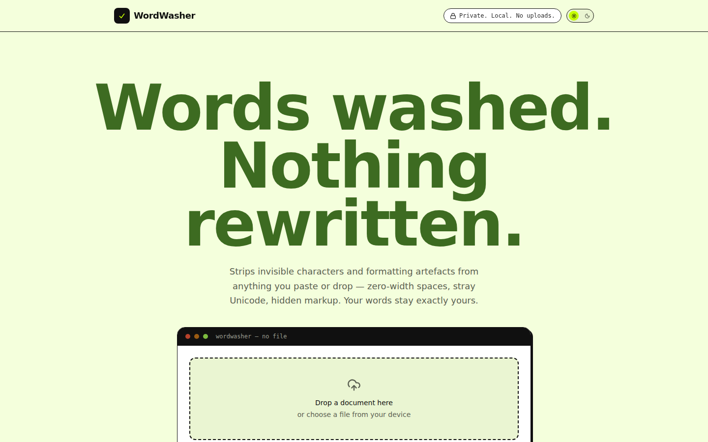</td>
<td>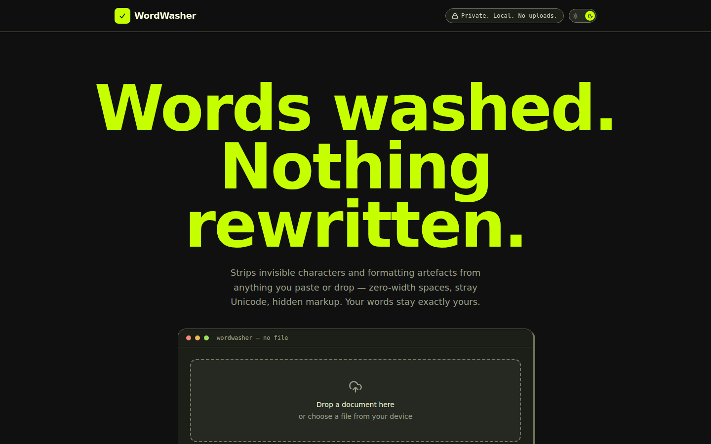</td>
</tr>
<tr>
<td>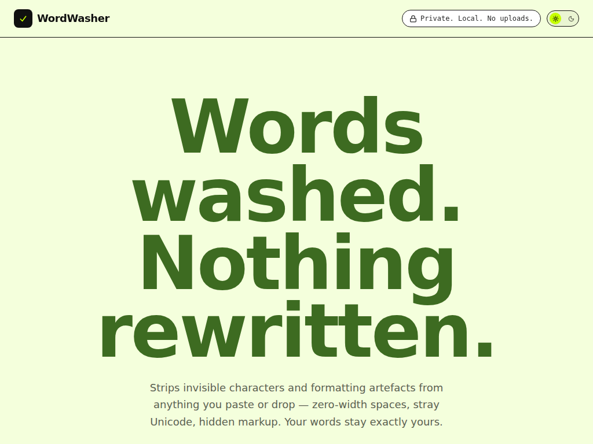</td>
<td>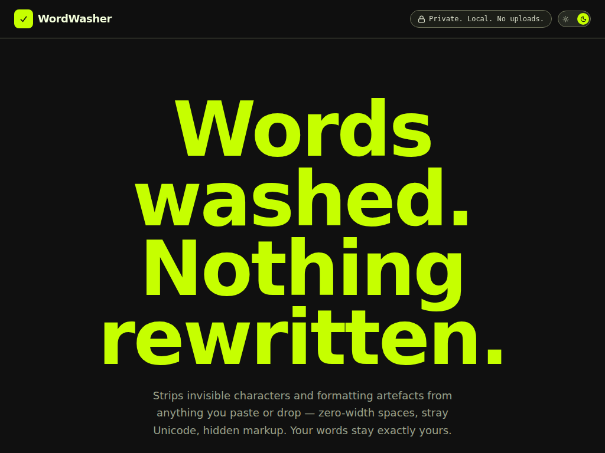</td>
</tr>
<tr>
<td>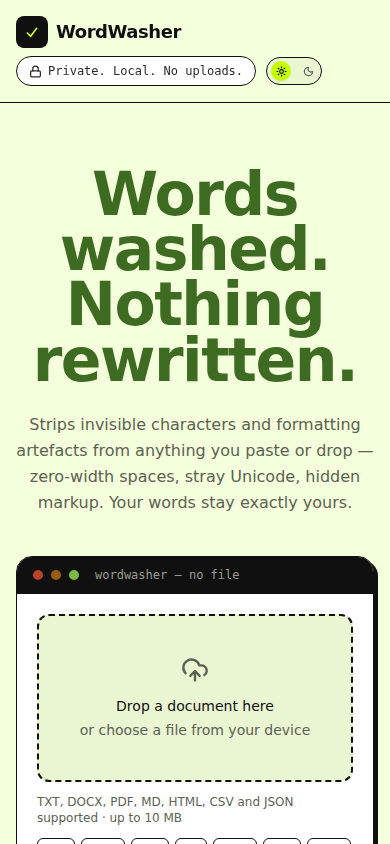</td>
<td>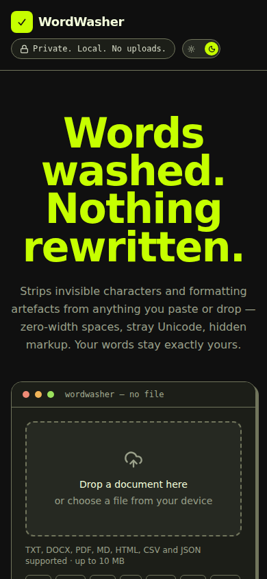</td>
</tr>
</table>

Tested at desktop (1280–1920px), tablet portrait and landscape (iPad-sized, 768×1024 /
1024×768) and mobile (390px) — no layout breakage, no horizontal scroll, no console
errors at any of them, in either theme.

The full paste → Clean → result flow, showing the metrics summary, cleaned output and
the Inspect changes table:

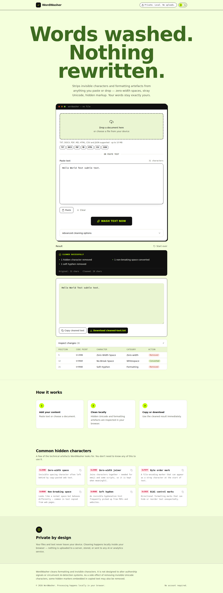

<details>
<summary>Full scroll — desktop, light theme</summary>
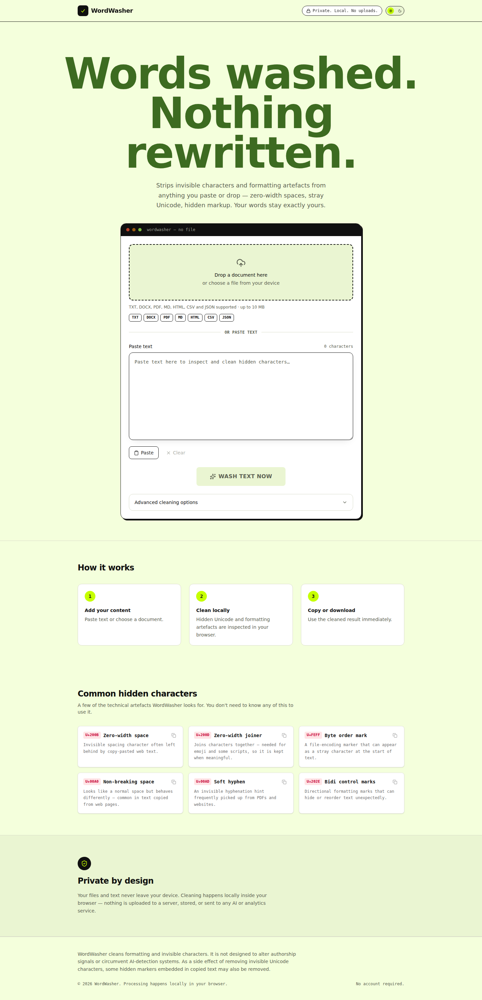
</details>

<details>
<summary>Full scroll — desktop, dark theme</summary>
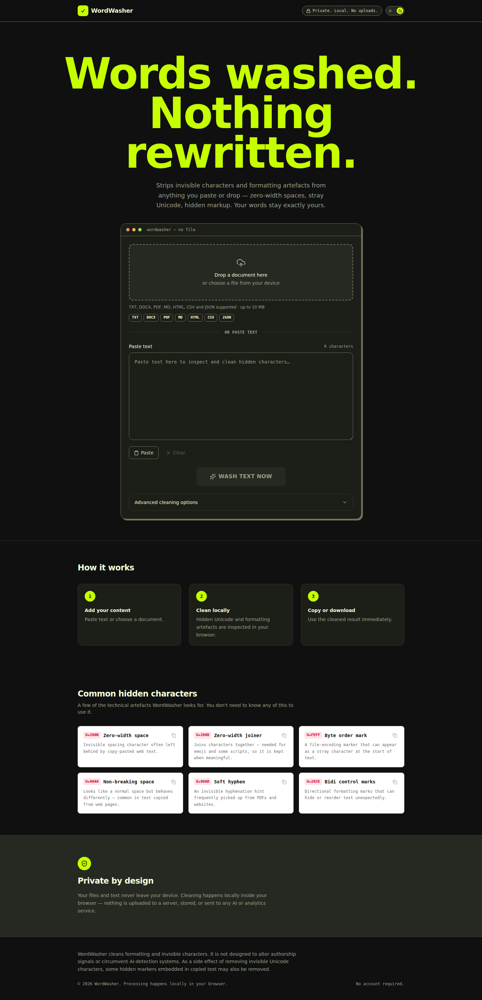
</details>

<details>
<summary>Full scroll — tablet landscape, light theme</summary>
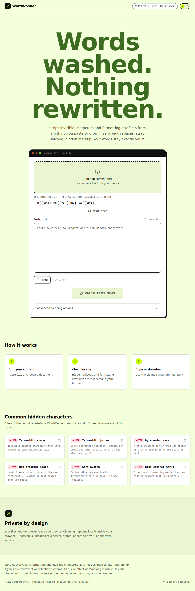
</details>

<details>
<summary>Full scroll — tablet landscape, dark theme</summary>
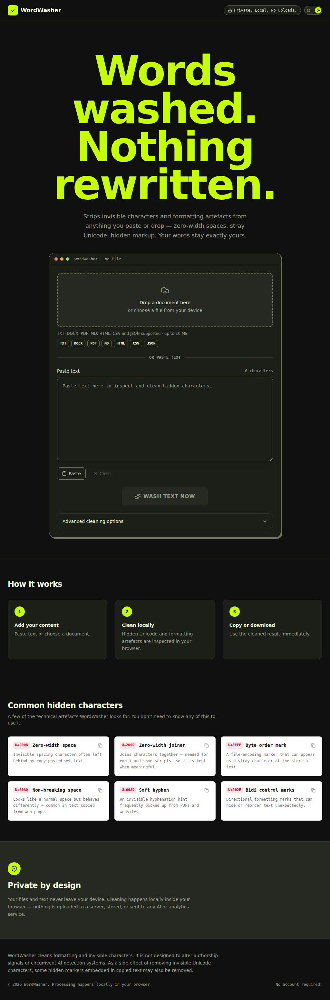
</details>

<details>
<summary>Full scroll — tablet portrait, light theme</summary>
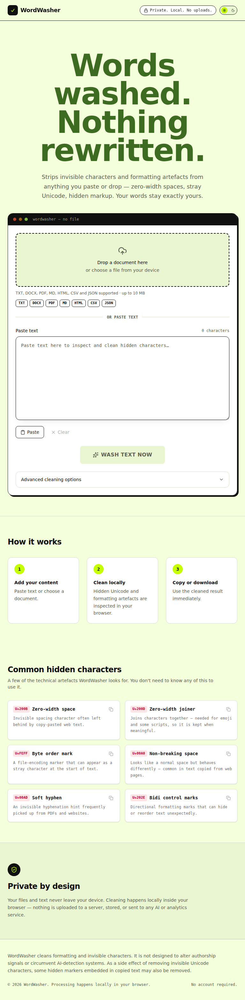
</details>

<details>
<summary>Full scroll — tablet portrait, dark theme (with a result + inspector open)</summary>
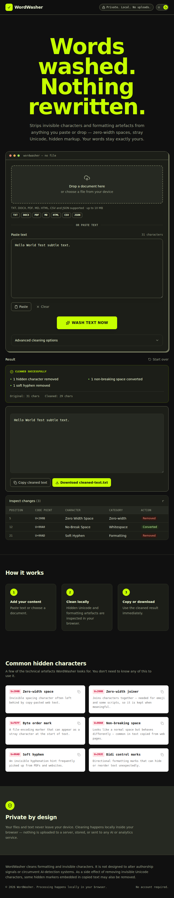
</details>

<details>
<summary>Full scroll — mobile, light theme</summary>
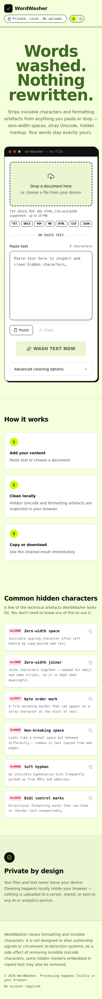
</details>

<details>
<summary>Full scroll — mobile, dark theme</summary>
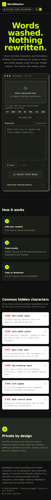
</details>

## Features

- **Paste text** or **drop a document** (drag-and-drop, click-to-choose, and the
  standard mobile file picker all work)
- Supports **TXT, Markdown, HTML, CSV, JSON, DOCX and PDF** (10 MB limit)
- Deterministic, conservative Unicode cleaning engine — no LLM, no rewriting of prose
- Format-aware cleaning:
  - **JSON** — parses and cleans only string values; invalid JSON is never modified
  - **CSV** — parsed with PapaParse; quoting, escaped quotes and delimiters preserved
  - **HTML** — parsed with `DOMParser`; tags/attributes/structure preserved, `<script>`
    and `<style>` content is never touched
  - **DOCX** — unzipped with JSZip; only text inside Word's `<w:t>` runs (body,
    headers, footers, footnotes, endnotes, comments) is modified — formatting,
    styles and tables are preserved
  - **PDF** — text extracted locally with pdf.js and cleaned; original page layout is
    not reconstructed, and encrypted/scanned/damaged PDFs are handled gracefully
- Results panel with a plain-language summary, plus a collapsible **Inspect changes**
  table (position, code point, name, category, action) capped at 500 rows
- Advanced cleaning options (collapsed by default, sensible defaults pre-selected)
- Reference cards for common hidden characters, styled as copyable code snippets
  (each has a one-click copy button for the character's escape sequence)
- Light and dark theme, switchable via the header toggle and remembered locally
- Nothing is uploaded, stored, or sent to any server, analytics platform or AI service

## Brand

- **Name:** WordWasher — a washer has one job: remove what shouldn't be there, leave
  the rest exactly as it was. That's the whole product thesis.
- **Domain:** [wordwasher.com](https://wordwasher.com)
- **Hero line:** "Words washed. Nothing rewritten."
- **Palette:** Ink `#101010`, Lime `#C6FF00`, Sage `#9BE15D`, Paper `#F4FFDC`
- **Type:** Unbounded (display), Manrope (body), Space Mono (data / code points)

Full positioning, voice, color/contrast rationale and visual-language rules:
[`docs/brand-brief.md`](docs/brand-brief.md).

## Tech stack

React + TypeScript + Vite + Tailwind CSS v4, with JSZip (DOCX), pdfjs-dist (PDF) and
PapaParse (CSV) loaded via dynamic `import()` so they never ship in the initial bundle.

## Project structure

```
src/
  components/   UI components (DropZone, TextInput, CleaningOptions, ResultSummary,
                 Inspector, FileTypeBadge, Header, Footer, ThemeToggle, ...)
  hooks/         useTheme.ts (light/dark toggle, persisted to localStorage)
  lib/           cleanText.ts (core engine), unicode.ts (character tables), and one
                 cleaner per format: cleanTxt, cleanMarkdown, cleanJson, cleanCsv,
                 cleanHtml, cleanDocx, cleanPdf — plus fileTypes.ts and download.ts
  types/         shared CleanResult / Finding / CleaningOptions types
  tests/         Vitest unit tests
  App.tsx        page composition and state
```

Note: internal module and function names (`cleanText`, `cleanJson`, `CleanResult`, ...)
describe what the code does and are unrelated to the product name — they're left as-is
regardless of branding.

## Getting started

Requires Node.js 20+.

```bash
npm install
npm run dev       # start the dev server (http://localhost:5173)
```

### Build & test

```bash
npm run build      # typecheck (tsc -b) + production build to dist/
npm run preview     # preview the production build locally
npm run test         # run the Vitest suite once
npm run test:watch  # run tests in watch mode
npm run typecheck   # typecheck only
npm run lint         # oxlint
```

## Privacy

WordWasher processes everything locally in your browser. Files and pasted text are
never uploaded to a server, sent to a third-party API, or stored — no `localStorage`,
`IndexedDB` or cookies are used to persist your content.

## Limitations (by design, for this version)

- PDF processing extracts and cleans text only — it does not recreate the original
  page layout, and scanned/image-only PDFs are not OCR'd
- Password-protected and `.docm` (macro-enabled) files are not supported
- Complex Word formatting may not always round-trip perfectly

## License

Private project — all rights reserved.
